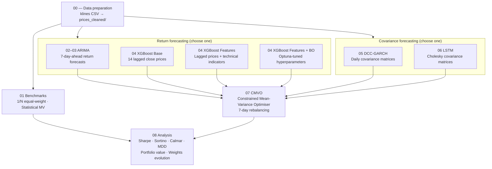

# Optimising a Dynamic Cryptocurrency Portfolio

**Research question:** How can temporal feature extraction and correlation structures be leveraged to optimise a dynamic cryptocurrency portfolio?

This repository contains the full modelling pipeline used to produce the results discussed in the accompanying report. The pipeline trains return-forecasting models (XGBoost variants, ARIMA) and covariance-forecasting models (DCC-GARCH, LSTM), combines them inside a Constrained Mean-Variance Optimiser (CMVO), and evaluates the resulting portfolios against two benchmarks (1/N equal-weight and statistical mean-variance).

The final analysis notebook (`08_Analysis of model performance (xgb_features_lstm).ipynb`) loads pre-computed outputs from earlier stages and generates all figures and tables referenced in the report.

---

## Repository structure

```
.
├── klines csv data/          # Raw OHLCV CSVs (one folder per coin)
│   └── prices_cleaned/       # Cleaned close-price CSVs (output of 00)
├── Results/                  # Intermediate .npy forecasts (output of 02–06)
├── 04 XGB results/           # XGBoost diagnostics
├── 06 LSTM results/          # LSTM checkpoints
├── 07 CMVO results/          # Portfolio time-series CSVs + metrics (output of 07)
│   └── bestmodelpredictions/ # Return and correlation CSVs for the best model
├── 08 Analysis results/      # Figures saved by notebook 08
│
├── 00_Dataframe Merging.ipynb
├── 01_Benchmarks_final.ipynb
├── 02_arima_order_selection.ipynb
├── 03_arima_7d_rebalance_test.ipynb
├── 04_XGBoost_Final_All_3_Models.ipynb
├── 05_Covariance_Features_DCC_GARCH_Daily.ipynb
├── 06_Covariance_LSTM.ipynb
├── 07_CMVO.ipynb
└── 08_Analysis of model performance (xgb_features_lstm).ipynb
```

---

## Prerequisites

- **Python 3.11** is recommended. The pipeline was developed on 3.13 but TensorFlow 2.21 (used by notebook 06) has the broadest wheel support on 3.11.
- The raw klines data is already included in the repository under `klines csv data/`. No external download is required.

---

## Setting up the environment

### 1. Create a virtual environment

From the repo root:

```bash
python -m venv .venv
```

### 2. Activate it

**Windows (PowerShell):**
```powershell
.venv\Scripts\Activate.ps1
```

**Windows (Command Prompt):**
```cmd
.venv\Scripts\activate.bat
```

**macOS / Linux:**
```bash
source .venv/bin/activate
```

### 3. Install dependencies

```bash
pip install -r requirements.txt
```

### 4. Register the kernel with Jupyter

```bash
python -m ipykernel install --user --name=crypto-portfolio --display-name "Python (crypto-portfolio)"
```

### 5. Launch Jupyter

```bash
jupyter notebook
```

When opening each notebook, select the **Python (crypto-portfolio)** kernel.

---

## Pipeline overview

The pipeline has three parallel tracks that feed into the optimiser. **Data preparation** (notebook 00) cleans the raw klines CSVs into a common format used by all downstream stages. **Return forecasting** (notebooks 02–04) produces 7-day-ahead price forecasts per coin using either ARIMA or one of three XGBoost variants. **Covariance forecasting** (notebooks 05–06) estimates the 8×8 coin covariance matrix at each rebalance step using either DCC-GARCH or an LSTM. Any return model can be paired with any covariance model; the CMVO (notebook 07) runs all combinations and outputs portfolio metrics. The benchmarks (notebook 01) run independently and feed directly into the final analysis (notebook 08).



---

## Running the pipeline

The notebooks must be run **in order**. Each notebook writes output files that the next one reads. All notebooks should be run from the **repo root** (the directory that contains this README); do not change the working directory inside them.

### Stage 0 — Data preparation

**`00_Dataframe Merging.ipynb`**

Reads raw OHLCV CSVs from `klines csv data/<COIN>/2022-04-01_2026-04-01/`, extracts daily close prices for all 8 coins (ADA, BCH, TRX, ETH, BNB, SOL, XRP, BTC), and writes one cleaned CSV per coin to `klines csv data/prices_cleaned/`.

**Output:** `klines csv data/prices_cleaned/<COIN>.csv`

---

### Stage 1 — Benchmarks

**`01_Benchmarks_final.ipynb`**

Constructs two benchmark portfolios over the full dataset and the test set:
- **1/N equal-weight** buy-and-hold
- **Statistical mean-variance** (weekly rebalancing, historical estimates)

Also evaluates a random-walk forecast baseline.

**Output:** `Results/benchmark_1n.csv`, `Results/benchmark_mv.csv` (consumed by notebook 07)

---

### Stage 2 — ARIMA return forecasts

**`02_arima_order_selection.ipynb`** — selects ARIMA orders per coin.

**`03_arima_7d_rebalance_test.ipynb`** — fits ARIMA models and produces 7-day-ahead return forecasts on the test set.

**Output:** `Results/ARIMA_test_7d_rebalance_forecast_matrix.npy`, `Results/ARIMA_test_7d_rebalance_actual_matrix.npy`

---

### Stage 3 — XGBoost return forecasts

**`04_XGBoost_Final_All_3_Models.ipynb`**

Trains three XGBoost models per coin (8 coins each), all forecasting 7-day-ahead prices on the test set:

| Model | Features |
|---|---|
| XGBoost Base | 14 lagged close prices |
| XGBoost Features | Lagged prices + technical indicators |
| XGBoost Features + Bayesian Optimisation | Same features, hyperparameters tuned with Optuna |

**Output:**
- `Results/XGBoost Base Forecast new return.npy`
- `Results/XGBoost Features Forecast new return.npy`
- `Results/Features and BO new return.npy`

---

### Stage 4 — DCC-GARCH covariance forecasts

**`05_Covariance_Features_DCC_GARCH_Daily.ipynb`**

Fits a DCC-GARCH model to daily log-returns for all 8 coins and reconstructs the covariance matrix at each test-set step.

**Output:** `Results/dcc_garch_daily_covariance_matrices_test.npy`

---

### Stage 5 — LSTM covariance forecasts

**`06_Covariance_LSTM.ipynb`**

Trains an LSTM to predict the upper-triangle Cholesky factor of the 8x8 covariance matrix from a rolling window of log-returns. The model checkpoint is saved to `06 LSTM results/`.

> **Note:** Restart the kernel before re-running this notebook. Seeds are set at import time; any prior TF operations in the same session will break reproducibility.

**Output:** `Results/lstm_cov_matrices.npy`

---

### Stage 6 — Portfolio optimisation (CMVO)

**`07_CMVO.ipynb`**

Combines all return and covariance forecasts inside a Constrained Mean-Variance Optimiser. Runs 10 portfolio combinations (3 XGBoost x 2 covariance + ARIMA x 2 covariance + 2 benchmarks), rebalancing every 7 days on the test set.

**Output (in `07 CMVO results/`):**
- One CSV per portfolio (e.g. `xgb_features_lstm.csv`) containing daily portfolio values and coin weights
- `all_portfolio_metrics.npy` — Sharpe, Sortino, Calmar ratio, MDD, and final value for every portfolio
- `bestmodelpredictions/xgb_features_returns.csv` and `bestmodelpredictions/lstm_correlations.csv`

---

### Stage 7 — Analysis (the target notebook)

**`08_Analysis of model performance (xgb_features_lstm).ipynb`**

Loads the outputs of all previous stages and produces:
- Performance metrics table (Sharpe, Sortino, Calmar, MDD) across all portfolios
- Portfolio value over time for all 8 portfolios
- Portfolio value comparison: best model (`xgb_features_lstm`) vs. both benchmarks
- Predicted return series per coin (XGBoost Features)
- Predicted correlation heatmaps (LSTM)
- Portfolio weight evolution (stacked area chart) for `xgb_features_lstm` and the MV benchmark

Figures are saved to `08 Analysis results/`.

---

## Reproducibility notes

- The LSTM (notebook 06) is only reproducible on the **same machine and TensorFlow version**. Switching between CPU/GPU or TF versions will shift outputs even with fixed seeds.
- All other notebooks are fully deterministic given the same input data.
- If you are only reproducing the final analysis (notebook 08), all required output files are already present in the repository (`Results/` and `07 CMVO results/`), so you can run notebook 08 directly without re-running the full pipeline.
